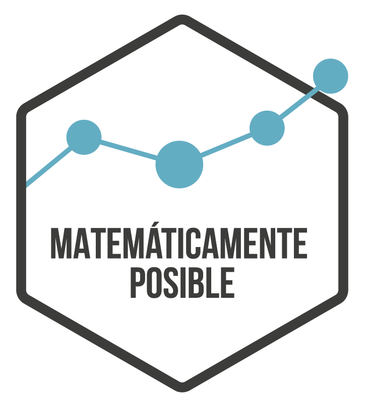

---

---

### **Blogs**

- [Matemáticamente posible](https://matematicamenteposible.net). 

- [Matemáticamente posible](https://www.facebook.com/matematicamenteposible/) sports analytics. [Code](https://github.com/jsaraviadrago/Mate-posible)

- [Stats SOS](https://statssos.net/) blog that explains statistics in a simple way

### **Presentations** 

- "Matemáticamente posible". (2019). TEDxYouthTukuy. Agosto. [Word cloud code](https://github.com/jsaraviadrago/Mate-posible). [Watch it here](https://www.youtube.com/watch?v=w2bFtUVihrs)

- "Matemáticamente posible". (2018). Pechakucha - Volumen 40. Octubre. [Watch it here](https://www.youtube.com/watch?v=kC85LBaDUZo&feature=youtu.be)

### **Other articles**

- Saravia, J. C. (2018). Cómo juega Perú. Revista H. 80 1-2.
[Cover](images/IMG_2809.JPG). [Article](images/Articulo_revista_H.pdf)