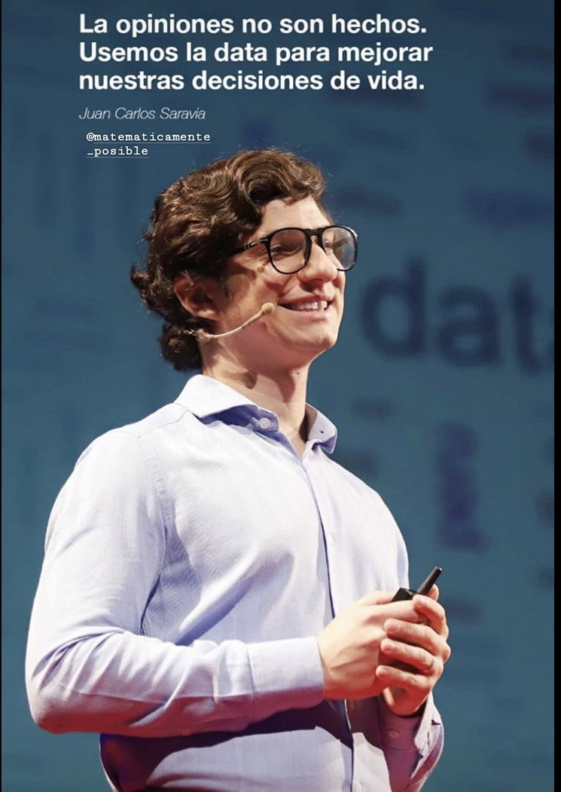

---

---

Mis intereses son responder las curiosidades del mundo con data, que esta sea amigable para todos y que esto nos lleve a usarla más en el día a día.

Soy psicólogo, master en estadística (Bélgica) y master en psicología de la salud. Estoy especializado en Data Analytics, Predictive Models y Psychometrics. Tengo experiencia liderando la construcción de modelos predictivos para empresas innovadoras, educación y salud. 
	
Curioso y autodidacta. Me apasiona utilizar Data - machine learning y predictive modelling- para generar insights que permitan replantear las estrategias de negocio.

Tengo la motivación de inspirar a la gente a que use la data para que tome mejores decisiones en los diversos ámbitos de su vida. Mi pasión me ha llevado a crear un espacio de sports analytics para mostrar que el fútbol puede verse de forma científica e interesante. Además, tengo un blog que invita a perderle el temor al uso de la data y a verla amigable.      

	

Mi CV completo lo puedes ver [aquí](Smart_Twenty_Seconds_CV_castellano.pdf)