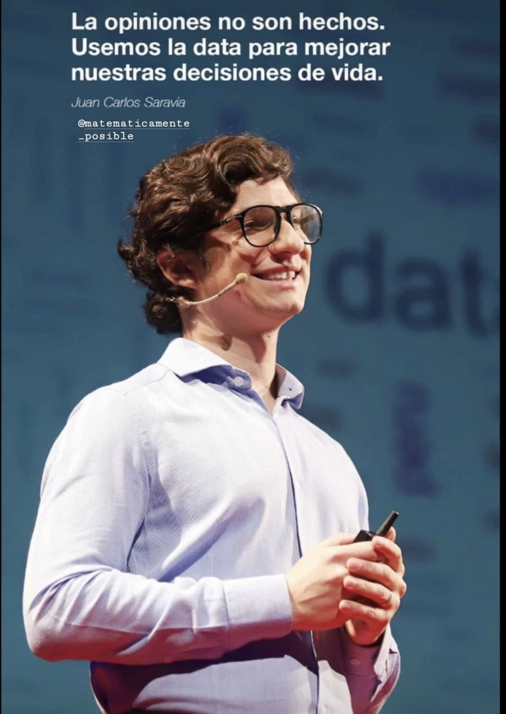

---

---

**What's my superpower? I'm like Megaman, I have weapons to solve all data challenges and situations.** 

My goal is to encourage and inspire others to use Data to make precise work-related decisions and solve curiosities in their everyday life. I’m passionate about translating Data into powerful insights that can shift business strategies and actions.

Expertise in Machine Learning, Psychometrics and Multilevel Modeling. Statistician and Psychologist. TED speaker. I have experience leading data teams on end-to-end predictive modeling in education, consumer goods and health enterprises. Tech-savvy with a love for learning. I use R, Python and Julia for work, play and for contributing to the community.

For play, I am working on an R package, named after my cats called bluegrafir, that makes easier psychometrics reports. For play, I do Sports Analytics and display results in my blog “Mathematically possible”. I tell the hidden story of how Peru’s national football team had chances to reach the World Cup after +30 years without attending the tournament. (We did!). 

You can look into my resume in spanish  [here](Juan_Carlos_Saravia_CV_castellano.pdf) and in english [here](Juan_Carlos_Saravia_resume.pdf)

Psychological profile and archetype [here](https://principlesyou.com/share/zJDVwPhln2lJmjE)

Skills and aptitudes [here]  

