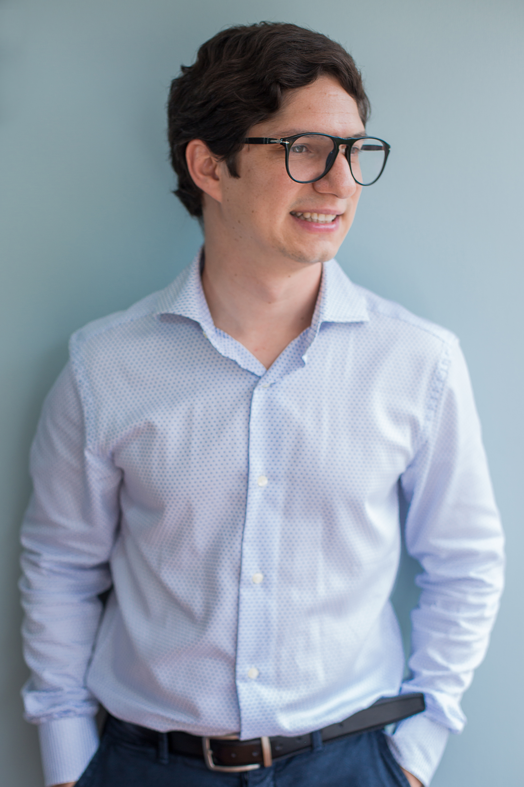

Psicólogo, master en estadística (Bélgica) y master en psicología de la salud. Especializado en Data Analytics, Predictive Models y Psychometrics. Con experiencia liderando la construcción de modelos predictivos para empresas innovadoras, educación y salud. 
	
Curioso y autodidacta. Me apasiona utilizar Data - machine learning y predictive modelling- para generar insights que permitan replantear las estrategias de negocio.
	

Mi CV completo lo puedes ver [aquí](Smart_Twenty_Seconds_CV_castellano.pdf)